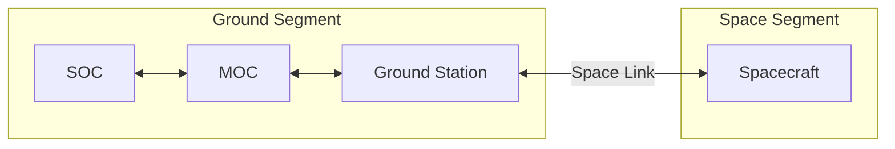

# Space System Crash Course

Think of a spacecraft as a highly autonomous robot living in the harshest environment imaginable.
It has to generate its own power, think for itself, control its body temperature, and talk to its creators millions of miles away, all while performing a complex job.

Flight software is the "nervous system" that makes this all possible. 
To write good flight software, you first need to understand the "body" it controls.
This page introduces the fundamental building blocks—the subsystems—that make up a typical space system.

## Space and Ground Segments

This section explains how the space link connects the spacecraft and ground segments.
The spacecraft segment may be one or more space vehicles or relays.
The ground segment may include a mission operations center (MOC), science operations center (SOC), and ground station.
Pieces of the space segment leverage radio frequency (RF) or optical communication where the ground segment typically uses terrestrial networks.

The space link connects the ground and space segments:

* Physical: antenna, RF front-end, modem/packetizer on the spacecraft and on the ground station. 
    * In TrySpace Lab the radio is simulated but the logical behavior is the same, some transformations are simply treated as a bent pipe as they would occur on one side then be undone on the other.
* Protocols: telemetry is sent in frames/packets (often CCSDS framing). 
    * Files are transferred using CFDP which handles segmentation, retransmit, and reliability.
* Modes: half-duplex (tx or rx) and duplex (simultaneous). 
    * Pass windows limit when uplinks or downlinks are possible.
    * Both physical and logistical reasons exist for limited windows such as being in view of the spacecraft or having the funds to schedule multiple passes.

## Two Halves of a Spacecraft: Bus and Payload

Every spacecraft can be split into two main parts:

* The Spacecraft Bus: 
    * This is the "life support" of the spacecraft. 
    * It's the collection of all the core subsystems that are required for the spacecraft to function, regardless of its specific mission. 
    * Think of it as the chassis, engine, and computer of a car.
* The Payload: 
    * This is the "mission equipment." 
    * It's the reason the spacecraft was launched in the first place. 
        * For a science mission, it might be a telescope. 
        * For a communications mission, it's a powerful antenna.

In TrySpace Lab, you will write the software that commands and controls both the bus and the payload where the payload is the "demo" component.

## The Spacecraft Bus

The bus is a "system of systems."
Here are the essential subsystems you'll interact with as a developer.

* Command & Data Handling (C&DH)
    * The flight computer or on-board computer (OBC).
* Electrical Power System (EPS)
    * The powerhouse of the ~~cell~~ spacecraft.
    * Typically contains batteries, power switches, and solar arrays.
* Telecommunication (COMMS)
    * The radios and antennas.
* Attitude Determination and Control System (ADCS)
    * Assumed to be an "ADCS In a Box" in TrySpace Lab.
    * Made up of various sensors, sense the environment, and actuators, impact the environment.
    * Enables the vehicle to point at various objects and manipulate itself.
* Thermal Control System (TCS)
    * Assumed to be passive in TrySpace Lab.
    * If active heaters, coolers, and thermistors to read the temperature to act would exist.

----
Last updated: 20250910
